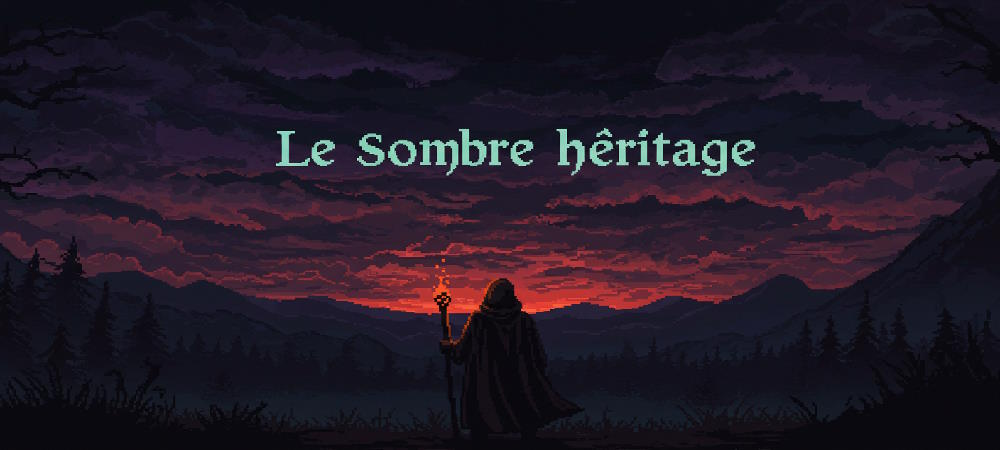

# Le Sombre Héritage

## 🕯️ Présentation

**Le Sombre Héritage** est un mini-jeu narratif interactif développé en **Java**, plongeant le joueur dans un univers sombre et mystérieux, entre héritage familial trouble, exploration psychologique, et choix lourds de conséquences.

Ce jeu repose sur une mécanique de navigation et de découverte par le biais d’interface textuelle. L'accent est mis sur **l'ambiance**, **la narration** et **les choix du joueur**.

## ⚙️ Technologies utilisées

- Java 17
- [Maven](https://maven.apache.org/)
